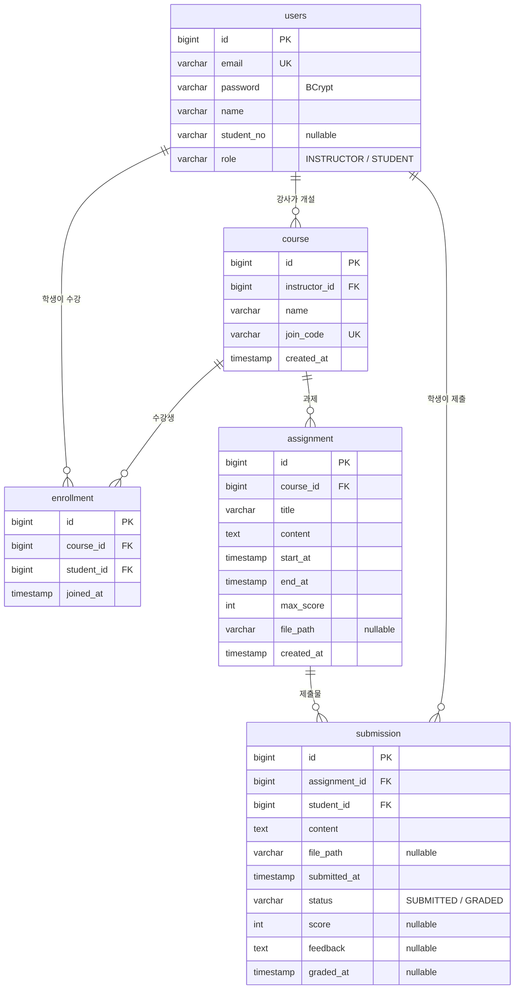

# AssignHub

> 강사가 과제를 내고, 수강생이 기간 안에 제출하고, 강사가 채점하고, 결과를 통계로 본다.

자바스프링 중간고사 대체 프로젝트 — 과제 제출 · 채점 LMS

- **역할**: 강사(INSTRUCTOR) · 학생(STUDENT)
- **기간**: 4주 (W1 설계 + 기반 → W2 강좌 · 과제 등록 → W3 제출 · 채점 → W4 통계 + 마무리)
- **설계 문서**: [요구사항 정의서 · 비즈니스 규칙 · 화면 목록 · ERD (xlsx)](docs/AssignHub_요구사항정의서_ERD.xlsx)

<br>

## 기술 스택

| 구분 | 사용 기술 |
|---|---|
| 백엔드 | Spring Boot 4.1.1 · Java 21 · Spring Data JPA |
| 인증 | Spring Security · 세션 기반 폼 로그인 · BCrypt |
| 화면 | Thymeleaf + Layout Dialect + thymeleaf-extras-springsecurity6 (서버 렌더링) |
| UI 템플릿 | SB Admin 2 (Bootstrap 4.6 · jQuery · Font Awesome 5) |
| 차트 · 표 | Chart.js 2.9 · DataTables |
| DB | PostgreSQL 16 (Docker) · 테스트는 H2 인메모리 |

<br>

## 실행 방법

**필요 환경**: JDK 21, Docker Desktop

```bash
# 1. DB 실행 (PostgreSQL 16, DB 이름 assignhub)
docker compose up -d

# 2. 앱 실행
./gradlew bootRun
```

브라우저에서 http://localhost:8080 접속

| 계정 | 이메일 | 비밀번호 | 비고 |
|---|---|---|---|
| 강사 | `instructor@test.com` | `password123` | 앱 시작 시 자동 생성 (U4) · 로컬 개발용 기본값 |
| 학생 | — | — | `/signup`에서 직접 가입 |

- DB 접속 정보 · 강사 계정 · 첨부파일 폴더는 환경변수로 바꿀 수 있습니다: `DB_USERNAME`, `DB_PASSWORD`, `INSTRUCTOR_EMAIL`, `INSTRUCTOR_PASSWORD`, `INSTRUCTOR_NAME`, `UPLOAD_DIR`(기본 `./uploads`, 10MB 제한)
- DB 초기화: `docker compose down -v` → `docker compose up -d`

<br>

## 기능 요구사항

✅ 완료 · 🚧 진행중 · ⏳ 예정

### 공통

| ID | 기능 | 내용 | 상태 |
|---|---|---|:---:|
| U1 | 학생 회원가입 | 학번 · 이름 · 이메일 · 비밀번호. 이메일 · 학번 중복 불가, 역할은 항상 STUDENT | ✅ |
| U2 | 로그인 · 로그아웃 | Spring Security 세션 기반 폼 로그인 (이메일 + 비밀번호) | ✅ |
| U3 | 역할별 메뉴 | 강사 / 학생 사이드바 분리, 권한 없는 URL은 403 | ✅ |
| U4 | 강사 계정 | 초기 데이터로 생성 (회원가입 불가) | ✅ |

### 강사 (INSTRUCTOR)

| ID | 기능 | 내용 | 상태 |
|---|---|---|:---:|
| I1 | 강좌 개설 | 참여코드 자동 발급 | ✅ |
| I2 | 수강생 목록 | 강좌별 등록 학생 조회 | ⏳ |
| I3 | 과제 등록 · 수정 · 삭제 | 시작/종료일시 · 배점 · 첨부 | ✅ |
| I4 | 제출 현황 | 과제별 제출 / 미제출 목록 | ⏳ |
| I5 | 채점 · 피드백 | 점수 + 코멘트 입력 | ⏳ |
| I6 | 통계 대시보드 | 제출률 · 점수 · 미제출자 | ⏳ |

### 학생 (STUDENT)

| ID | 기능 | 내용 | 상태 |
|---|---|---|:---:|
| S1 | 수강 등록 | 참여코드 입력 | ✅ |
| S2 | 내 과제 목록 | 예정 · 진행중 · 마감 배지 | ✅ |
| S3 | 과제 제출 · 재제출 | 기간 안에서만 · 파일 첨부 | ⏳ |
| S4 | 결과 확인 | 점수 · 피드백 조회 | ⏳ |
| S5 | 내 통계 | 제출률 · 평균 점수 · 마감 임박 | ⏳ |

<br>

## 비즈니스 규칙

> 화면에서 막는 것은 "편의", 서버에서 막는 것은 "보안" — 모든 규칙은 **Service 계층**에서 검사합니다.

| # | 규칙 | 관련 기능 | 위반 시 처리 |
|---|---|:---:|---|
| B1 | 제출은 시작일시 ≤ 현재 ≤ 종료일시 일 때만 가능 | S3 | "제출 기간이 아닙니다" 알림 |
| B2 | 해당 강좌에 수강 등록된 학생만 과제 열람 · 제출 | S2 · S3 | 403 페이지 |
| B3 | 과제당 학생 1건 — 기간 내 재제출은 덮어쓰기 | S3 | 기존 제출 수정 |
| B4 | 채점 완료(GRADED)된 제출은 재제출 불가 | S3 · I5 | "채점 완료된 과제" 알림 |
| B5 | 강사는 본인 강좌의 과제만 수정 · 삭제 · 채점 | I3 · I5 | 403 페이지 |
| B6 | 점수는 0 이상 배점(max_score) 이하 | I5 | 폼 에러 메시지 |
| B7 | 종료일시는 시작일시보다 뒤 | I3 | 폼 에러 메시지 |
| B8 | 제출이 1건이라도 있는 과제는 삭제 불가 | I3 | "제출물이 있어 삭제 불가" 알림 |

<br>

## ERD



- `enrollment` : **UNIQUE (course_id, student_id)** — 중복 수강 불가
- `submission` : **UNIQUE (assignment_id, student_id)** — 과제당 학생 1건 (B3)
- `user`는 PostgreSQL 예약어라 테이블명을 `users`로 사용
- 추가 컬럼: 없음 (수업 제공 ERD 그대로 사용)

<br>

## 화면 목록

SB Admin 2 페이지를 복사해 내용만 바꿔 사용합니다.

| 역할 | URL | 화면 | SB Admin 2 원본 |
|---|---|---|---|
| 공통 | `/login` · `/signup` | 로그인 · 학생 회원가입 | login.html · register.html |
| 공통 | `/` | 역할별 대시보드 | index.html |
| 강사 | `/instructor/courses` · `/{id}` | 강좌 목록 · 상세 | tables.html · cards.html |
| 강사 | `/instructor/assignments/new` · `/{id}/edit` | 과제 등록 · 수정 | forms |
| 강사 | `/instructor/assignments/{id}/submissions` | 제출 현황 + 미제출자 | tables.html (DataTables) |
| 강사 | `/instructor/submissions/{id}/grade` | 채점 · 피드백 | cards.html + form |
| 강사 | `/instructor/stats` | 통계 대시보드 | charts.html |
| 학생 | `/student/courses/join` | 참여코드 입력 | forms |
| 학생 | `/student/assignments` · `/{id}` | 내 과제 목록 · 상세 + 제출 | tables.html · cards.html |
| 학생 | `/student/submissions` | 내 제출 · 점수 · 피드백 | tables.html |
| 공통 | `/error/403` · `/error/404` | 권한 없음 · 없는 페이지 | 404.html |

<br>

## 프로젝트 구조

```
src/main/java/com/hjh/assignhub
├── assignment/  과제 엔티티 · 강사 과제 관리(I3) · 학생 과제 목록/상세(S2) · 상태 배지
├── auth/        로그인 사용자(LoginUser) · UserDetailsService · 로그인/회원가입 컨트롤러
├── common/      대시보드 · 에러 페이지 · 첨부파일 저장/다운로드 · 공통 예외
├── config/      SecurityConfig · 강사 초기 계정(InstructorInitializer)
├── course/      강좌 엔티티 · 강좌 개설/참여코드 발급(I1)
├── enrollment/  수강 엔티티 · 참여코드로 수강 등록(S1)
├── submission/  제출 엔티티 (제출 · 채점 기능은 W3)
└── user/        User 엔티티 · Role · Repository · UserService · 회원가입 폼

src/main/resources/templates
├── layout/      default(사이드바 포함) · auth(로그인/가입용)
├── fragments/   sidebar · topbar · alerts · assets(CDN)
├── auth/        login · signup
├── instructor/  courses(목록 · 상세) · assignments(등록 · 수정 폼)
├── student/     courses(수강 등록) · assignments(목록 · 상세)
├── error/       403 · 404
└── index.html   역할별 대시보드
```

<br>

## 테스트

```bash
./gradlew test
```

테스트는 PostgreSQL 없이 H2 인메모리 DB로 실행됩니다 (`src/test/resources/application.yaml`).

<br>

## 개발 규칙

- **브랜치**: `main`(제출) ← `develop`(통합) ← `feature/*`(기능 단위) · PR은 항상 `develop`으로
- **커밋 메시지**: 요구사항 ID 포함 — 예) `feat: S3 과제 제출 기간 검증`
